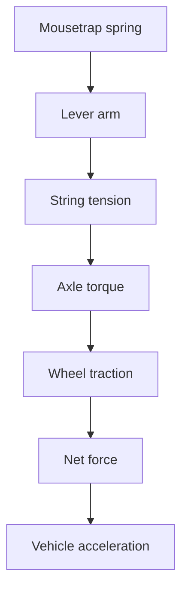

# TrapMotion


**TrapMotion** is a Python-based physics simulator for designing and analyzing mousetrap-powered cars.

The project combines programming, mathematics, and mechanics to estimate how design choices—such as wheel diameter, axle diameter, string length, spring strength, and vehicle mass—affect the car's theoretical performance.

The long-term goal is to build a tool that not only calculates results, but also explains **why** each design choice helps or limits the vehicle.

> This project is being developed incrementally. Each version adds a new layer to the physical model while keeping the calculations understandable and testable.

## Project goals

- Estimate whether a mousetrap car can reach a target distance, such as **10 meters**.
- Explain the physical effect of each design parameter.
- Compare theoretical performance across different vehicle configurations.
- Identify limitations such as rolling resistance, insufficient traction, and energy losses.
- Suggest design improvements based on the simulation results.
- Present the results through diagnostics, recommendations, and graphs in future versions.

## Current features

TrapMotion currently includes four completed simulation stages:

### V1 — Geometry and theoretical range

Calculates:

- wheel and axle radius;
- wheel and axle circumference;
- number of axle rotations produced by the string;
- theoretical distance traveled;
- comparison between the theoretical distance and the target distance.

The main geometric relationship is:

```text
theoretical distance = axle rotations × wheel circumference
```

### V2 — Spring, torque, and force transmission

Adds a simplified torsion-spring model and calculates:

- initial and current spring torque;
- stored and released elastic energy;
- string tension;
- torque transmitted to the axle;
- ideal traction force at the wheels;
- remaining spring energy.

Main equations:

```text
τ = k × θ
E = 1/2 × k × θ²
T = τ / L
τ_axle = T × r_axle
F_traction = τ_axle / r_wheel
```

### V3 — Mass and ideal acceleration

Introduces the total mass of the vehicle and applies Newton's second law:

```text
a = F / m
```

This version estimates the car's ideal acceleration before resistance and traction limits are considered.

### V4 — Rolling resistance and net force

Adds the force that opposes the motion of the vehicle:

```text
F_weight = m × g
F_normal = F_weight
F_rolling = μ_rr × F_normal
F_net = F_traction - F_rolling
a_real = F_net / m
```

This makes the result more realistic by checking whether the available traction force is sufficient to overcome rolling resistance.

## Roadmap

| Version | Stage | Status |
|---|---|---|
| V1 | Geometry and theoretical range | ✅ Completed |
| V2 | Spring, torque, and force transmission | ✅ Completed |
| V3 | Mass and ideal acceleration | ✅ Completed |
| V4 | Rolling resistance and net force | ✅ Completed |
| V5 | Wheel grip and traction limit | 🚧 In development |
| V6 | Motion over time | 📋 Planned |
| V7 | Speed, position, and traveled distance | 📋 Planned |
| V8 | Verification of the 10-meter target | 📋 Planned |
| V9 | Design analysis and improvement suggestions | 📋 Planned |
| V10 | Graphs and result visualization | 📋 Planned |
| V11 | Final interface and complete integration | 📋 Planned |

## Project structure

```text
TrapMotion/
├── README.md
├── modelo_v1.md
├── modelo_v2.md
├── modelo_v3.md
├── modelo_v4.md
├── simulador_v1.py
├── simulador_v2.py
├── simulador_v3.py
└── simulador_v4.py
```

- `simulador_vN.py`: executable Python simulation for each development stage.
- `modelo_vN.md`: documentation of the equations, variables, assumptions, and tests used in that version.

## Requirements

- Python 3.x
- No external libraries are currently required.

The project uses only Python's standard library.

## Installation

Clone the repository:

```bash
git clone https://github.com/bezolemos/TrapMotion.git
cd TrapMotion
```

Alternatively, download the repository as a ZIP file and extract it on your computer.

## How to run

Run the latest completed version:

```bash
python simulador_v4.py
```

On some systems, the command may be:

```bash
python3 simulador_v4.py
```

The program will request the physical parameters of the mousetrap car and then display the calculated results and diagnostics.

You can also run an earlier version to study how the simulator evolved:

```bash
python simulador_v1.py
python simulador_v2.py
python simulador_v3.py
```

## Main input parameters

| Parameter | Symbol | Unit | Description |
|---|---:|---:|---|
| Wheel diameter | `d_wheel` | cm | Diameter of the drive wheels |
| Axle diameter | `d_axle` | cm | Diameter of the axle where the string is wound |
| String length | `L_string` | cm | Useful length of the string |
| Lever-arm length | `L` | cm or m | Distance from the spring axis to the string attachment point |
| Spring torsional constant | `k` | N·m/rad | Stiffness of the mousetrap spring |
| Spring angle | `θ` | degrees or radians | Angular displacement of the spring |
| Vehicle mass | `m` | g or kg | Total mass of the car |
| Rolling resistance coefficient | `μ_rr` | dimensionless | Simplified resistance between the wheels and the surface |
| Target distance | `d_target` | m | Distance the vehicle is expected to reach |

All values are converted to SI units before the main physical calculations whenever necessary.

## Physical model

The simulator follows the energy and force transfer through the vehicle:



The geometry determines the theoretical range, while the spring supplies torque and energy. That torque is transmitted through the lever arm and string to the axle. The wheels convert axle torque into traction force, which must overcome the forces resisting motion.

## Assumptions and current limitations

The current version is an educational model, not a complete engineering simulation. It assumes that:

- the surface is level;
- the string does not stretch;
- the wheels and axle remain aligned;
- the torsional spring behaves approximately linearly;
- rolling resistance is represented by a constant coefficient;
- the transmission of force is simplified;
- component deformation and mechanical imperfections are ignored.

The current version does **not yet** fully model:

- wheel slipping and maximum grip;
- rotational inertia of the wheels;
- motion as a function of time;
- changes in speed and position;
- aerodynamic drag;
- detailed friction in the axle and bearings;
- experimental calibration with a real vehicle.

Because of these simplifications, the results should be interpreted as theoretical estimates rather than guaranteed real-world performance.

## Development approach

Each version of TrapMotion follows the same process:

1. Define the physical problem.
2. Explain the required equations and units.
3. Perform a manual test with expected values.
4. Implement one new physical effect at a time.
5. Validate user input.
6. Compare the program output with the manual calculation.
7. Document the model, assumptions, and limitations.

This incremental approach makes the project easier to understand, test, and improve.

## Educational purpose

TrapMotion was created as an interdisciplinary project involving:

- Python programming;
- algorithmic thinking;
- mathematical modeling;
- classical mechanics;
- engineering design;
- software documentation;
- experimental validation.

The project is also part of my programming portfolio and demonstrates the evolution of a simulation from a simple geometric calculator into a more complete physics-based design tool.

## Future vision

The final version is planned to include:

- complete movement simulation;
- distance, time, speed, and acceleration calculations;
- verification of whether the car reaches 10 meters;
- automatic design diagnostics;
- optimization suggestions;
- graphs showing the vehicle's behavior;
- a user-friendly interface;
- comparison between theoretical and experimental results.

## Author

Developed by **Bernardo Lemos**.

- GitHub: [@bezolemos](https://github.com/bezolemos)

---

If you found this project interesting, feel free to explore the different versions and follow its development.
