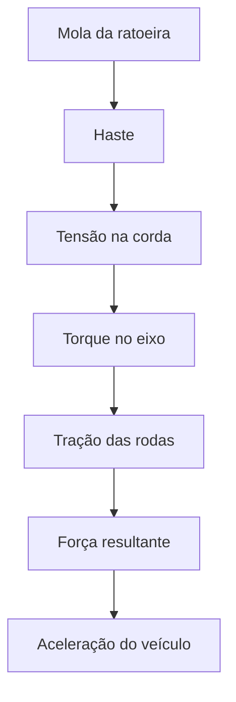

# TrapMotion


**TrapMotion** é um simulador de física desenvolvido em Python para projetar e analisar carrinhos movidos por ratoeira.

O projeto combina programação, matemática e mecânica para estimar como diferentes escolhas de projeto — como diâmetro das rodas, diâmetro do eixo, comprimento da corda, força da mola e massa do veículo — afetam o desempenho teórico do carrinho.

O objetivo de longo prazo é construir uma ferramenta que não apenas calcule os resultados, mas também explique **por que** cada escolha de projeto ajuda ou limita o veículo.

> Este projeto está sendo desenvolvido de forma incremental. Cada versão adiciona uma nova camada ao modelo físico, mantendo os cálculos compreensíveis e testáveis.

## Objetivos do projeto

- Estimar se um carrinho movido por ratoeira consegue atingir uma distância-alvo, como **10 metros**.
- Explicar o efeito físico de cada parâmetro do projeto.
- Comparar o desempenho teórico entre diferentes configurações do veículo.
- Identificar limitações como resistência ao rolamento, tração insuficiente e perdas de energia.
- Sugerir melhorias no projeto com base nos resultados da simulação.
- Apresentar os resultados por meio de diagnósticos, recomendações e gráficos em versões futuras.

## Funcionalidades atuais

O TrapMotion atualmente possui quatro etapas de simulação concluídas:

### V1 — Geometria e alcance teórico

Calcula:

- raio da roda e do eixo;
- circunferência da roda e do eixo;
- número de rotações do eixo produzidas pela corda;
- distância teórica percorrida;
- comparação entre a distância teórica e a distância-alvo.

A principal relação geométrica utilizada é:

```text
distância teórica = rotações do eixo × circunferência da roda
```

### V2 — Mola, torque e transmissão de força

Adiciona um modelo simplificado de mola de torção e calcula:

- torque inicial e atual da mola;
- energia elástica armazenada e liberada;
- tensão na corda;
- torque transmitido ao eixo;
- força de tração ideal nas rodas;
- energia restante na mola.

Principais equações:

```text
τ = k × θ
E = 1/2 × k × θ²
T = τ / L
τ_eixo = T × r_eixo
F_tração = τ_eixo / r_roda
```

### V3 — Massa e aceleração ideal

Introduz a massa total do veículo e aplica a segunda lei de Newton:

```text
a = F / m
```

Essa versão estima a aceleração ideal do carrinho antes de considerar resistências e limites de tração.

### V4 — Resistência ao rolamento e força resultante

Adiciona a força que se opõe ao movimento do veículo:

```text
F_peso = m × g
F_normal = F_peso
F_rolamento = μ_rr × F_normal
F_resultante = F_tração - F_rolamento
a_real = F_resultante / m
```

Isso torna o resultado mais realista ao verificar se a força de tração disponível é suficiente para superar a resistência ao rolamento.

## Roteiro de desenvolvimento

| Versão | Etapa | Status |
|---|---|---|
| V1 | Geometria e alcance teórico | ✅ Concluída |
| V2 | Mola, torque e transmissão de força | ✅ Concluída |
| V3 | Massa e aceleração ideal | ✅ Concluída |
| V4 | Resistência ao rolamento e força resultante | ✅ Concluída |
| V5 | Aderência das rodas e limite de tração | 🚧 Em desenvolvimento |
| V6 | Movimento ao longo do tempo | 📋 Planejada |
| V7 | Velocidade, posição e distância percorrida | 📋 Planejada |
| V8 | Verificação da meta de 10 metros | 📋 Planejada |
| V9 | Análise do projeto e sugestões de melhoria | 📋 Planejada |
| V10 | Gráficos e visualização dos resultados | 📋 Planejada |
| V11 | Interface final e integração completa | 📋 Planejada |

## Estrutura do projeto

```text
TrapMotion/
├── README.md
├── modelo_v1.md
├── modelo_v2.md
├── modelo_v3.md
├── modelo_v4.md
├── simulador_v1.py
├── simulador_v2.py
├── simulador_v3.py
└── simulador_v4.py
```

- `simulador_vN.py`: simulação executável em Python correspondente a cada etapa de desenvolvimento.
- `modelo_vN.md`: documentação das equações, variáveis, suposições e testes utilizados em cada versão.

## Requisitos

- Python 3.x
- Atualmente não são necessárias bibliotecas externas.

O projeto utiliza apenas a biblioteca padrão do Python.

## Instalação

Clone o repositório:

```bash
git clone https://github.com/bezolemos/TrapMotion.git
cd TrapMotion
```

Como alternativa, você pode baixar o repositório como um arquivo ZIP e extraí-lo no seu computador.

## Como executar

Execute a versão concluída mais recente:

```bash
python simulador_v4.py
```

Em alguns sistemas, o comando pode ser:

```bash
python3 simulador_v4.py
```

O programa solicitará os parâmetros físicos do carrinho movido por ratoeira e, em seguida, exibirá os resultados calculados e os diagnósticos.

Também é possível executar versões anteriores para acompanhar a evolução do simulador:

```bash
python simulador_v1.py
python simulador_v2.py
python simulador_v3.py
```

## Principais parâmetros de entrada

| Parâmetro | Símbolo | Unidade | Descrição |
|---|---:|---:|---|
| Diâmetro da roda | `d_roda` | cm | Diâmetro das rodas de tração |
| Diâmetro do eixo | `d_eixo` | cm | Diâmetro do eixo onde a corda é enrolada |
| Comprimento da corda | `L_corda` | cm | Comprimento útil da corda |
| Comprimento da haste | `L` | cm ou m | Distância entre o eixo da mola e o ponto de fixação da corda |
| Constante torsional da mola | `k` | N·m/rad | Rigidez da mola da ratoeira |
| Ângulo da mola | `θ` | graus ou radianos | Deslocamento angular da mola |
| Massa do veículo | `m` | g ou kg | Massa total do carrinho |
| Coeficiente de resistência ao rolamento | `μ_rr` | adimensional | Resistência simplificada entre as rodas e a superfície |
| Distância-alvo | `d_alvo` | m | Distância que o veículo deve atingir |

Todos os valores são convertidos para unidades do SI antes dos principais cálculos físicos, quando necessário.

## Modelo físico

O simulador acompanha a transferência de energia e força ao longo do veículo:


```mermaid
flowchart TD
    A[Mola da ratoeira] --> B[Haste]
    B --> C[Tensão na corda]
    C --> D[Torque no eixo]
    D --> E[Tração das rodas]
    E --> F[Força resultante]
    F --> G[Aceleração do veículo]
```

A geometria determina o alcance teórico, enquanto a mola fornece torque e energia. Esse torque é transmitido pela haste e pela corda até o eixo. As rodas convertem o torque do eixo em força de tração, que precisa superar as forças que resistem ao movimento.

## Suposições e limitações atuais

A versão atual é um modelo educacional, e não uma simulação completa de engenharia.

O modelo considera que:

- a superfície é plana;
- a corda não se estica;
- as rodas e o eixo permanecem alinhados;
- a mola de torção se comporta aproximadamente de forma linear;
- a resistência ao rolamento é representada por um coeficiente constante;
- a transmissão de força é simplificada;
- deformações dos componentes e imperfeições mecânicas são ignoradas.

A versão atual **ainda não modela completamente**:

- derrapagem das rodas e aderência máxima;
- inércia rotacional das rodas;
- movimento em função do tempo;
- variações de velocidade e posição;
- resistência aerodinâmica;
- atrito detalhado no eixo e nos rolamentos;
- calibração experimental utilizando um veículo real.

Devido a essas simplificações, os resultados devem ser interpretados como estimativas teóricas, e não como garantias de desempenho no mundo real.

## Método de desenvolvimento

Cada versão do TrapMotion segue o mesmo processo:

1. Definir o problema físico.
2. Explicar as equações e unidades necessárias.
3. Realizar um teste manual com valores esperados.
4. Implementar um novo efeito físico por vez.
5. Validar as entradas fornecidas pelo usuário.
6. Comparar o resultado do programa com o cálculo manual.
7. Documentar o modelo, suas suposições e limitações.

Essa abordagem incremental torna o projeto mais fácil de compreender, testar e melhorar.

## Objetivo educacional

O TrapMotion foi criado como um projeto interdisciplinar envolvendo:

- programação em Python;
- pensamento algorítmico;
- modelagem matemática;
- mecânica clássica;
- projeto de engenharia;
- documentação de software;
- validação experimental.

O projeto também faz parte do meu portfólio de programação e demonstra a evolução de uma simulação, começando como uma calculadora geométrica simples e evoluindo para uma ferramenta mais completa de análise física e de projeto.

## Visão futura

A versão final está planejada para incluir:

- simulação completa do movimento;
- cálculos de distância, tempo, velocidade e aceleração;
- verificação automática de alcance da meta de 10 metros;
- diagnósticos automáticos do projeto;
- sugestões de otimização;
- gráficos mostrando o comportamento do veículo;
- interface amigável para o usuário;
- comparação entre resultados teóricos e experimentais.

## Autor

Desenvolvido por **Bernardo Lemos**.

- GitHub: [@bezolemos](https://github.com/bezolemos)

---

Se você achou este projeto interessante, fique à vontade para explorar as diferentes versões e acompanhar seu desenvolvimento.
